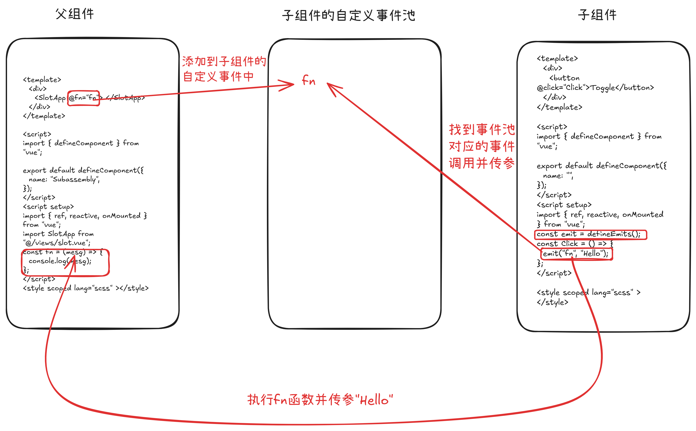

### VUE

##### 一，安装Vue3

```vue
命令 pnpm create vue@latest
```

##### 二，Vue2

```
在Vue2中，vue是一个构造函数类，我们使用Vue构建项目，就是创建此类的一个实例！
 vue2采用的OptionsAPI(配置项)
 基于data构建数据
 基于methods创建方法
 基于computed创建计算属性
```

##### 三，在Vue中如何指定视图

```vue
1.基于el配置项指定
	let vm = new Vue({
		el:"#app"
	})
2.基于template 配置项指定
	let vm = new Vue({
		date:{
			name:"张三"，
		}，
		template：`
				 <div>{{name}}</div> 
				 `
	})
	vm.$mount("#app")
3.基于vm.$mount 指定
4.基于render 配置项指定（基于JSX语法构建视图）
```

##### 四，为何在data中写的数据，在视图中可以直接访问？

```
在data中构建的数据，会直接挂载到实例上，作为私有属性
所有在实例上挂载的属性，都可以直接在视图中使用
```

##### 五，为什么非要写在data当中

```
在data编写的数据，是经过数据劫持的，它是响应式的数据，修改数据值，视图会自动更新
在给实例设置的键值对，不是响应式的
```

##### 六，什么叫数据劫持，为什么写在data中的数据就成为响应式的了？

```js
在data中写的数据，都会经历get/set处理 ===》vue2当中
ste劫持：就是当我们修改数据值的时候，会触发其set函数执行，在函数中不仅仅修改数据。而且还会通知视图重新渲染
数据劫持只发生在new Vue这个阶段
    let obj = {
      x: 1,
      y: 10,
    };
    let props = { ...obj };

    Object.defineProperty(obj, "y", {
      get() {
        // 当访问属性y的时候触发get函数
        // get函数返回的是什么，y的值就是什么
        // 不能直接返回obj.y，否则会导致死递归
        return props.y;
      },
      set(val) {
        // 当修改属性y的时候，会触发set函数
        // val就是我们新设置的值
        props.y = val;
      },
    });
```

##### 七，new Vue

```js
// 在new Vue阶段，Vue内部会处理很多事，其中有一件事：执行initState，在此方法执行中，又做了很多事情
// initProps$1：初始属性
// initMethods:初始methods配置项中的信息
// initData：处理配置项中data中的数据信息的

// initData中处理的事情
//     把data中的数据挂载到实例上
//     并且对data中的每一项数据进行数据劫持(基于Object.defineproperty进行GET/SET劫持，做劫持的目的是：
//     当后续修改数据的时候，会触发SET，在此函数中，不仅仅修改数据值，而且会通知视图更新，实现数据驱动视图的
//     渲染，我们也把做了劫持的数据，称之为响应式数据/状态，
//     )
//     Vue内部会基于递归的方式，对data中的数据进行深度的监听和劫持(只处理对象(普通对象)和数组)
//	   对于Vue来讲，只对data的可枚举，非Symbol和私有属性做数据的代理劫持以及挂在到实例上
//	   不可枚举以及Symbol类型不会做数据劫持代理以及不会挂在实例上
//	   对于数据来讲，数组的每一项成员是数字索引，Vue内部并不会对每一项做GET/SET劫持
//	   它是给数组做了重定向，让数组先指向自己构建的原型对象,通过自己构建的原型对象上
//	   有7个方法：push/pop/shift/unshift/splice/sort/reverse
//     $set:
			vm.$set(object,key,value)
			不能基于$set给vm实例对象设置属性
            但是可以对data中的对象可以设置属性，可以成为响应式
            基于$set修改非响应式的数据，修改后也不会成为响应式的
            基于$set修改数组的值可以让视图发生更新
            
修改数组的值，让视图更新有几种方法
	1.vm.arr.splice(0,1,0)  把数组的第一个项修改为0
    2.vm.$set(vm.arr,0,0)
	3.vm.arr[0]=0 vm.$forceUpdate强制更新
	4.vm.arr=vm.arr.mpa(i=>i+1)
```

##### 八，响应式部分源码

```js
  // 视图更新
  const compiler = ()=>{
      console.log("视图更新");
  }
第一步：
	创建一个observer函数，接收一个对象或者数组，模拟源码数据劫持代理，
    进来判断传参是否是一个对象或者数组，如果都不是则返回参数
    如果是数组则进行数组的处理，需要重新指定原型，并重写7个变异数组方法，数组元素还是数组则继续处理
    如果是对象则进行对象的处理，首先拿到对象所有的key，并且克隆一份对象，完成数据代理
    而后遍历所有key组成的数组，并把每一项进行数据劫持，对象下的属性还是对象则继续处理
	        const observer =(obj)=>{
            // 判断是否为对象
            let isObj = Object.prototype.toString.call(obj) === '[object Object]';
            // 判断是否为数组
            let isArr = Object.prototype.toString.call(obj) === '[object Array]';
            // 不是对象也不是数组，直接返回
            if(!isObj && !isArr) return obj;
            // 数组处理：重新原型指向
            if(isArr){
                observerArr(obj);
                // 递归处理，深层次处理
                obj.forEach((item,index)=> observer(item))
                return obj
            }
            // 对象处理：数据劫持
            let keys = Object.keys(obj);
            // 代理对象
            let proxy={...obj}
            keys.forEach((key)=>{
                observerObj(obj,key,obj[key],proxy)
                // 递归处理，深层次处理
                observer(obj[key])
            })
            return obj
        }
第二步：
	创建一个处理数组的方法，接收一个数组
    首先先创建一个proto对象让传进observer函数的数组指向它，当参数调用7个变异方法时就会调用重写后的
    然后在这proto对象中添加重写7个变异方法，这七个方法不能被枚举，并且proto对象原型要指向Array.prototype，
	调用这7个方法修改数组时，则会通知视图更新
	当参数调用7个方法以外的方法则会找到原生的方法，还需要注意新增方法中的对数组新增元素也要做代理
         //重写的原型对象
        // 添加不可枚举属性，指向原数组
        const def = (obj,key,value,enumerable)=>{
            Object.defineProperty(obj,key,{
                value,
                configurable:true,
                enumerable:!!enumerable,
                writable:true
            })
        }
        let proto={}
        let arrMethods = ['push','pop','shift','unshift','splice','reverse','sort'];
        arrMethods.forEach(name=>{
            def(proto,name,function mutator(...args){
              let res = Array.prototype[name].apply(this,args);
              let inserted;
              switch(name){
                case 'push':
                case 'unshift':
                  inserted = args;
                  break;
                case 'splice':
                  inserted = args.slice(2);
                  break;
              }
              if(Array.isArray(inserted)){
                inserted.forEach(item=>{
                  observer(item)
                })
              }
              compiler()
              return res
            })
        })
        Object.setPrototypeOf(proto,Array.prototype);
        // 数组处理的方法
        const observerArr = (arr)=>{
            //重新指定原型指向
            Object.setPrototypeOf(arr,proto);
        }
第三步：
	创建一个处理对象函数，进行数据劫持，接收三个参数：属性名，属性值，代理的对象，
    首先判断对象是否被冻结，被冻结则不进行劫持，未冻结则用defineProperty进行劫持
    get()方法返回代理的属性值，set方法首先判断新值是否与代理的旧值相同，相同不处理，
    不相同则进行修改，并把修改值在进行数据劫持代理，通知视图更新
            const observerObj = (obj,key,val,proxy)=>{
            // 如果对象是被冻结的，则直接返回
            if(Object.isFrozen(obj)) return;
            Object.defineProperty(obj,key,{
                get(){
                    return proxy[key]
                },
                set(newValue){
                    if(newValue === proxy[key]) return;
                    proxy[key]=observer(newValue);//对于新设置的值进行数据劫持
                    compiler()
                }
            })
        }
```

##### 九，Vue指令

```js
所谓的指令其实就是给标签的设置“自定义指令”，一共15个指令

v-text：更新元素的文本内容。

v-html：更新元素的 innerHTML。

v-show：基于表达式值的真假性，来改变元素的可见性。

v-if：基于表达式值的真假性，来条件性地渲染元素或者模板片段。

v-else：表示 v-if 或 v-if / v-else-if 链式调用的“else 块”。

v-else-if：表示 v-if 的“else if 块”。可以进行链式调用。

v-for：基于原始数据多次渲染元素或模板块。

v-on：给元素绑定事件监听器。
	修饰符：
		.stop - 调用 event.stopPropagation()。
        .prevent - 调用 event.preventDefault()。
        .capture - 在捕获模式添加事件监听器。
        .self - 只有事件从元素本身发出才触发处理函数。
        .{keyAlias} - 只在某些按键下触发处理函数。
        .once - 最多触发一次处理函数。
        .left - 只在鼠标左键事件触发处理函数。
        .right - 只在鼠标右键事件触发处理函数。
        .middle - 只在鼠标中键事件触发处理函数。
        .passive - 通过 { passive: true } 附加一个 DOM 事件。
        
v-bind：动态的绑定一个或多个 attribute，也可以是组件的 prop。

v-model：在表单输入元素或组件上创建双向绑定。
		.lazy - 监听 change 事件而不是 input
        .number - 将输入的合法字符串转为数字
        .trim - 移除输入内容两端空格

v-slot：用于声明具名插槽或是期望接收 props 的作用域插槽。

v-pre：跳过该元素及其所有子元素的编译。

v-once：仅渲染元素和组件一次，并跳过之后的更新。

v-memo：缓存一个模板的子树。
		在元素和组件上都可以使用。
        为了实现缓存，该指令需要传入一个固定长度的依赖值数组进行比较。
        如果数组里的每个值都与最后一次的渲染相同，那么整个子树的更新将被跳过
        
v-cloak：当使用直接在 DOM 中书写的模板时，
		可能会出现一种叫做“未编译模板闪现”的情况：
        用户可能先看到的是还没编译完成的双大括号标签，
        直到挂载的组件将它们替换为实际渲染的内容。
```

##### 十，V-on原理

```js
methods：定义项目中需要的方法
	在new阶段，执行initMethods方法，把methods中的每一项挂载到实例上，(但是经过bind处理的)
	并且基于bind$1(或者nativeBind)，把函数先处理this（把this改为vm实例）
	让函数中的this永远指向当前创建的实例，
	所以不能在methods定义的方法不能是箭头函数
原理：
	基于v-on实现事件绑定，Vue内部是基于addEventListener 实现的事件绑定，Vue内部首先会解释成一个对象
	{
		name："v-on",
		args:["click"],
		vlaue:fn
	}
	元素：addEventListtener("click",function()=>{
		//做很多处理
		fn()
	})
逻辑整理:
	首先在newVue的阶段，Vue内部会执行函数initState函数，在initState函数会处理很多逻辑，
	initProps$1：初始属性
    initMethods:初始methods配置项中的信息
    initData：处理配置项中data中的数据信息的
    等等....
    initMethods函数就是处理Vue中所有的定义好的函数，会把methods中的每一项挂载到vue实例上，
    并且会基于Vue内部的bind$1或者nativeBind，把函数的this指向改为Vue实例，
    当渲染元素的时候Vue发现元素上有v-on或者@符这个指令，并发现绑定了事件，
    那么Vue内部就会用addEventListener对元素进行对应的事件绑定，
    在addEventListener回调函数中首先会处理一些相关逻辑，例如一些修饰符的相关逻辑，
    最后执行v-on绑定的事件

事件委托优惠循环添加事件性能：
	<template>
      <div
        @click="handleClick"
        style="width: 100px; height: 100px; background-color: red"
      >
        <div
          style="
            width: 50px;
            height: 50px;
            background-color: #000;
            margin-bottom: 20px;
          "
          v-for="(i, index) in arr"
          :key="i.id"
          :myIndex="index"
        ></div>
      </div>
    </template>
    <script>
    import { defineComponent } from "vue";
    export default defineComponent({
      name: "App",
    });
    </script>
    <script setup>
    import { ref, reactive, onMounted } from "vue";
    const arr = ref([
      { id: 1, name: "张三", age: 18 },
      { id: 2, name: "李四", age: 19 },
      { id: 3, name: "王五", age: 20 },
      { id: 4, name: "赵六", age: 21 },
      { id: 5, name: "钱七", age: 22 },
      { id: 6, name: "孙八", age: 23 },
      { id: 7, name: "周九", age: 24 },
    ]);
    const handleClick = (e) => {
      console.log(e.target.getAttribute("myIndex"));
    };
    </script>
    <style scoped lang="scss" ></style>
```

##### 十一，v-bind与v-model指令

```vue
v-model:其实就是v-bind：value + @input 的语法糖
    <template>
      <div>
        <input type="text" :value="text" @input="text = $event.target.value" />
        <div>{{ text }}</div>
      </div>
    </template>
    <script>
    import { defineComponent } from "vue";
    export default defineComponent({
      name: "App",
    });
    </script>
    <script setup>
    import { ref, reactive, onMounted } from "vue";
    const text = ref("Hello World");
    </script>
    <style scoped lang="scss" ></style>
```

##### 十二，渲染优化指令

```vue
v-pre:控制Vue在编译视图的时候，跳过这个元素以及后代元素
    <template>
      <div>
        <div v-pre>{{ name }}</div>
      </div>
    </template>

    <script>
    import { defineComponent } from "vue";
    export default defineComponent({
      name: "",
    });
    </script>
    <script setup>
    import { ref, reactive, onMounted } from "vue";
    const name = ref("Vue 3");
    </script>
    <style scoped lang="scss" ></style>
视图所渲染： {{name}}   不会编译

v-cloak：当使用直接在 DOM 中书写的模板时，
		可能会出现一种叫做“未编译模板闪现”的情况：
        用户可能先看到的是还没编译完成的双大括号标签，
        直到挂载的组件将它们替换为实际渲染的内容。
		但是在打包过后，所有的视图模板都是打包在js文件

v-once:仅渲染元素和组件一次，并跳过之后的更新。
```

##### 十三，computed计算属性

```vue
每次视图的渲染或者更新，Vue都会把所有的内容，自上而下，
按照最新的数据值进行编译(编译的结果事虚拟DOM：vnode)
如果是第一次渲染，则直接把vnode渲染渲染真实的DOM，渲染在页面中
如果是视图更新，会拿本次编译的vnode和上一次的vnode进行对比（diff），
把差异的部分创建成对应的补丁包，最后把补丁包的内容进行更新

computed计算属性：
	作用计算缓存，只有computed函数内用到的数值发生变化才会执行，其他属性值发生变化并不会执行
	如果用普通函数做计算，则会在任何的属性值发生变化视图更新，都会导致普通函数重新执行，
	计算结果会被挂载在vue实例上,
	计算结果也会被响应式的数据劫持（GET/SET），但是和data中做的数据劫持是不一样的

	GTE:computedGetter 目的是获取计算属性的值
        首先看有没有缓存的结果
        没有：说明是第一次渲染，则把函数执行，计算一个新的值出来（并把这个值缓存起来）
        有：说明不是第一次渲染，是组件更新，此时再看依赖的状态值是否发生变化
            没变化：直接获取缓存的值
            有变化：把函数重新执行，重新计算新的值（并且再次缓存）
	SET：默认情况下，如果手动修改计算属性的值，会触发SET劫持函数，而此劫持函数中会抛出一个警告错误
    <template>
      <div>
        <div>X:{{ x }}</div>
        <div>Y:{{ y }}</div>
        <div>Z:{{ z }}</div>
        <div>a:{{ a }}</div>
        <button @click="x++">x++</button>
        <button @click="a++">a++</button>
      </div>
    </template>

    <script>
    import { defineComponent } from "vue";

    export default defineComponent({
      name: "",
    });
    </script>
    <script setup>
    import { ref, reactive, onMounted, computed } from "vue";
    const x = ref(0);
    const y = ref(1);
    const a = ref(0);
    // const z = () => {
    //   console.log(123);
    //   return x.value + y.value;
    // };
    const z = computed(() => {
      console.log(123);
      return x.value + y.value;
    });
    </script>

    <style scoped lang="scss" ></style>

接受一个 getter 函数，返回一个只读的响应式 ref 对象。
该 ref 通过 .value 暴露 getter 函数的返回值。
它也可以接受一个带有 get 和 set 函数的对象来创建一个可写的 ref 对象。

computed计算属性：传一个函数只能读，传一个对象,可读可写
				{
					get:()=>{},
					set:()=>{}
				}
在new Vue的阶段计算属性是不会执行的，只有当用计算属性的值时，才会执行
```

##### 十五，watch监听器

```js
当监听的值发生改变，会把对应的函数执行，函数中的thi指向是实例
在new的时候，监听的函数不会立即执行
watch(
  a,
  (newVal, oldVal) => {
    console.log(newVal, oldVal);
  },
  {
    immediate: true,//立即监听
    deep: true,//深度监听
  }
);
```

##### 十六，watch和computed的区别

```
watch:
	在new的 先执行initWatch函数，在此方法中迭代watch对象，
	把每一项的值（可能是函数，可能是对象，还可能是数组）基于createWatcher进行处理！
	如果有一项的值是一个数组，则把数组中的每一项都要基于 creatWacther进行处理
	在creatWatcher函数中，最后也是基于Vue.prototype.$watch实现对这一项监听
	而在$watch这个函数中，也是基于Watcher类的实例，实现监听处理的！和computed又是一致的
	
computed：
	在new这个阶段，先执行initComputed$1方法，在此函数中：
	首先迭代computed对象（配置项）中的每一项
	把每一项，基于创建Watcher类的实例，进行监听处理
	把每一项都执行defineComputed方法，对其每一项进行GET/SET劫持
	在defineConputed方法中
		GET劫持数据：是把createComputedGetter函数执行
		SET劫持数据：如果我们没有设置，则设置为一个执行就报错的函数；如果设置了，就以我们设置的为主
	在createComputedGetter方法中
		执行返回computedGetter这个函数，这个函数就是计算属性做的GET劫持
		当我们后期在视图中等地方，获取计算属性值的时候，执行computedGetter
	在computedGetter方法中
		基于Watcher类实例，以及提供的方法，算出最后的值
		
watch和computed：
	从底层源码上来讲，不论watch还是computed都是通过watcher类实现监听处理的
	1.如果是依赖一到多个状态，但是最后要算出一个新的值，此时用computed更好，
	  因为除了自动监听以为，还具备计算缓存的结果，有助于性能提高
	2.如果就是想监听某一个值的变化后，做一些逻辑处理，此时可以用watch处理
	所以在开发的时候一般优先考虑computed计算属性，能用其解决，就用它解决，实在不行就用watch
```

##### 十七，生命周期

```
beforeCreate：在组件实例初始化完成之后立即调用。

created：在组件实例处理完所有与状态相关的选项后调用。

beforeMount：在组件被挂载之前调用。：

mounted：在组件被挂载之后调用。

beforeUpdate：在组件即将因为一个响应式状态变更而更新其 DOM 树之前调用。

updated：在组件因为一个响应式状态变更而更新其 DOM 树之后调用。

beforeUnmount：在一个组件实例被卸载之前调用。

unmounted：在一个组件实例被卸载之后调用。

errorCaptured：在捕获了后代组件传递的错误时调用。

renderTracked：在一个响应式依赖被组件的渲染作用追踪后调用。（仅开发）

renderTriggered：在一个响应式依赖被组件触发了重新渲染之后调用。（仅开发）

activated：若组件实例是 <KeepAlive> 缓存树的一部分，当组件被插入到 DOM 中时调用。

deactivated：若组件实例是 <KeepAlive> 缓存树的一部分，当组件从 DOM 中被移除时调用。

serverPrefetch：当组件实例在服务器上被渲染之前要完成的异步函数。（仅服务器渲染）
```

##### 十八，nextTick

```
在Vue当中每次更改状态是同步的，但是通知视图更新是异步

在Vue当中，每一次修改状态值，都会触发SET劫持函数，对于数组来讲，是基于重写的7个方法修改某一项的值
	1.立即修改状态值（同步）
	2.但是不会立即通知组件更新，而是把本次需要更新的需求，
	  放在一个任务队列中；当同步代码执行完毕，在统一处理任务队列中的事情，
	  这样处理的目的：同时修改多个状态值时，不是每修改一个就更新一次，而是统一更新一次，(异步)
	  如果需要更新造成更新多次，则需要把更新状态值放在异步即可，
	  但是如果你不在视图使用修改状态值，则不会触发视图去更新
nextTick：	  
	首先在修改状态值时，修改状态值这个是同步执行的，然后通知视图更新是异步执行的，
	会把所有的需要更新视图的任务放进一个视图更新队列中，
	如果途中有存在nextTick函数，则会把nextTick放进callBacks队列中
	当所有的状态值修改完成后，开始执行视图更新队列中更新视图任务，当视图队列任务全部更新完成后，
	会由vue内部callHooks$1,通知callBacks队列nextTick进行执行
```


##### 十九，为什么在Vue2组件中，要求data必须是一个函数？

```
我们创建的组件可能会被调用多次，
如果data不基于闭包管理进行管理，那么多次调用，使用的那些状态值就会相互冲突，
所以我们需要把data基于闭包包裹起来，让每次调用，所有的状态都是本次私有的
```

##### 二十，Component 动态组件

```vue
Component:
	导入所需要的的组件，
	使用defineOptions注册组件，
	component组件绑定is属性绑定对应组件名称即可（字符串）
<template>
  <div>
    <div @click="handleChange">
      <button v-for="(item, index) in arr" :myIndex="index" :key="item.id">
        {{ item.name }}
      </button>
    </div>
    <component :is="arr[actuveIndex].name"></component>
  </div>
</template>

<script>
import { defineComponent } from "vue";

export default defineComponent({
  name: "",
});
</script>
<script setup>
import { ref, reactive, onMounted, shallowRef, markRaw } from "vue";
import A from "./views/A.vue";
import B from "./views/B.vue";
import C from "./views/C.vue";
const actuveIndex = ref(0);
defineOptions({
  components: {
    A,
    B,
    C,
  },
});
const arr = ref([
  {
    name: "A",
    id: 1,
  },
  {
    name: "B",
    id: 2,
  },
  {
    name: "C",
    id: 3,
  },
]);
const handleChange = (e) => {
  actuveIndex.value = +e.target.getAttribute("myIndex");
};
</script>
<style scoped lang="scss"></style>
```

##### 二十一，插槽

```vue
默认插槽：
	
	父组件：
		<template>
          <div>
            <SlotApp>
              <div>我是默认插槽</div>
            </SlotApp>
          </div>
        </template>
        <script>
        import { defineComponent } from "vue";
        export default defineComponent({
          name: "Subassembly",
        });
        </script>
        <script setup>
        import { ref, reactive, onMounted } from "vue";
        import SlotApp from "@/views/slot.vue";
        </script>
        <style scoped lang="scss" ></style>
	子组件：
		<template>
          <div>
            <slot></slot>
          </div>
        </template>
        <script>
        import { defineComponent } from "vue";
        export default defineComponent({
          name: "SlotApp",
        });
        </script>
        <script setup>
        import { ref, reactive, onMounted } from "vue";
        </script>
        <style scoped lang="scss" ></style>
		
具名插槽：

	父组件：
		<template>
          <div>
            <SlotApp>
              <template #main>我是主体</template>
              <template #header>我是头部</template>
              <template #footer>我是底部</template>
            </SlotApp>
          </div>
        </template>
        <script>
        import { defineComponent } from "vue";
        export default defineComponent({
          name: "Subassembly",
        });
        </script>
        <script setup>
        import { ref, reactive, onMounted } from "vue";
        import SlotApp from "@/views/slot.vue";
        </script>
        <style scoped lang="scss" ></style>

	子组件：
		<template>
          <div class="slot">
            <div>
              <slot name="header"></slot>
            </div>
            <div>
              <slot name="main"></slot>
            </div>
            <div>
              <slot name="footer"></slot>
            </div>
          </div>
        </template>
        <script>
        import { defineComponent } from "vue";
        export default defineComponent({
          name: "Slot",
        });
        </script>
        <script setup>
        import { ref, reactive, onMounted } from "vue";
        </script>
        <style scoped lang="scss" >
        </style>
条件插槽：
	父组件：
		<template>
          <div>
            <SlotApp>
              <template #main>我是主体</template>
              <template #header>我是头部</template>
              <template #footer>我是底部</template>
            </SlotApp>
          </div>
        </template>

        <script>
        import { defineComponent } from "vue";
        export default defineComponent({
          name: "Subassembly",
        });
        </script>
        <script setup>
        import { ref, reactive, onMounted } from "vue";
        import SlotApp from "@/views/slot.vue";
        </script>
        <style scoped lang="scss" ></style>
	子组件：
		<template>
          <div class="slot">
            <div v-if="$slots.header">
              <slot name="header"></slot>
            </div>
            <div v-if="$slots.main">
              <slot name="main"></slot>
            </div>
            <div v-if="$slots.footer">
              <slot name="footer"></slot>
            </div>
          </div>
        </template>
        <script>
        import { defineComponent } from "vue";
        export default defineComponent({
          name: "Slot",
        });
        </script>
        <script setup>
        import { ref, reactive, onMounted } from "vue";
        </script>
        <style scoped lang="scss" >
        </style>
动态插槽：
	父组件：
		<template>
          <div>
            <SlotApp>
              <template #[variables1]>我是头部</template>
              <template #[variables2]>我是主体</template>
              <template #[variables3]>我是底部</template>
            </SlotApp>
          </div>
        </template>

        <script>
        import { defineComponent } from "vue";
        export default defineComponent({
          name: "Subassembly",
        });
        </script>
        <script setup>
        import { ref, reactive, onMounted } from "vue";
        import SlotApp from "@/views/slot.vue";
        const variables1 = ref("header");
        const variables2 = ref("main");
        const variables3 = ref("footer");
        </script>
        <style scoped lang="scss" ></style>

	子组件：
		<template>
          <div class="slot">
            <div>
              <slot name="header"></slot>
            </div>
            <div>
              <slot name="main"></slot>
            </div>
            <div>
              <slot name="footer"></slot>
            </div>
          </div>
        </template>

        <script>
        import { defineComponent } from "vue";

        export default defineComponent({
          name: "Slot",
        });
        </script>
        <script setup>
        import { ref, reactive, onMounted } from "vue";
        </script>
        <style scoped lang="scss" >
        </style>

插槽作用域：实现子父传参
	父组件：
		<template>
          <div>
            <SlotApp>
              <template #[variables1]="{ list }">
                <div v-for="item in list" :key="item">{{ item.name }}</div>
              </template>
              <template #[variables2]>我是主体</template>
              <template #[variables3]>我是底部</template>
            </SlotApp>
          </div>
        </template>
        <script>
        import { defineComponent } from "vue";
        export default defineComponent({
          name: "Subassembly",
        });
        </script>
        <script setup>
        import { ref, reactive, onMounted } from "vue";
        import SlotApp from "@/views/slot.vue";
        const variables1 = ref("header");
        const variables2 = ref("main");
        const variables3 = ref("footer");
        </script>
        <style scoped lang="scss" ></style>
	
	子组件：
		<template>
          <div class="slot">
            <div>
              <slot name="header" :list="list"></slot>
            </div>
            <div>
              <slot name="main"></slot>
            </div>
            <div>
              <slot name="footer"></slot>
            </div>
          </div>
        </template>
        <script>
        import { defineComponent } from "vue";
        export default defineComponent({
          name: "Slot",
        });
        </script>
        <script setup>
        import { ref, reactive, onMounted } from "vue";
        const list = ref([
          { name: "张三", age: 18 },
          { name: "李四", age: 19 },
          { name: "王五", age: 20 },
        ]);
        </script>
        <style scoped lang="scss" >
        </style>
```

##### 二十二，自定义事件

```vue
每次调用子组件，都是创建子组件的一个实例，而在每个实例，都是有一个自定事件池
父组件：
	<template>
      <div>
        <SlotApp @fn="fn"> </SlotApp>
      </div>
    </template>
    <script>
    import { defineComponent } from "vue";
    export default defineComponent({
      name: "Subassembly",
    });
    </script>
    <script setup>
    import { ref, reactive, onMounted } from "vue";
    import SlotApp from "@/views/slot.vue";
    const fn = (mesg) => {
      console.log(mesg);
    };
    </script>
    <style scoped lang="scss" ></style>
子组件：
	<template>
      <div>
        <button @click="Click">Toggle</button>
      </div>
    </template>
    <script>
    import { defineComponent } from "vue";
    export default defineComponent({
      name: "",
    });
    </script>
    <script setup>
    import { ref, reactive, onMounted } from "vue";
    const emit = defineEmits();
    const Click = () => {
      emit("fn", "Hello");
    };
    </script>
    <style scoped lang="scss" ></style>

在父组件定义某一个事件，使用v-on或者@符绑定给子组件
在子组件可以调用defineEmits拿到emit事件，
emit()方法可以接收两个参数
	参数一：父组件绑定的对应事件名称
	参数二：传给父组件的的参数 (在父组件定义的函数接收的参数就是子组件传递过来的)
```



##### 二十三，全局自定义指令

```js
在mian.js中注册
使用app.directive()方法接收两个参数
	参数一：指令名称，
	参数二：一个对象，多个生命周期
    
    el：绑定的标签元素
    binding.valeu：绑定的值
	vnode：虚拟DOM
    prevVnode:代表之前的渲染中指令所绑定元素的 VNode。仅在 beforeUpdate 和 updated 钩子中可用。
    
	app.directive("background",{
      // 在绑定元素的 attribute 前
      // 或事件监听器应用前调用
      created(el, binding, vnode) {
        // 下面会介绍各个参数的细节
      },
      // 在元素被插入到 DOM 前调用
      beforeMount(el, binding, vnode) {},
      // 在绑定元素的父组件
      // 及他自己的所有子节点都挂载完成后调用
      mounted(el, binding, vnode) {
        el.style.background = binding.value
      },
      // 绑定元素的父组件更新前调用
      beforeUpdate(el, binding, vnode, prevVnode) {},
      // 在绑定元素的父组件
      // 及他自己的所有子节点都更新后调用
      updated(el, binding, vnode, prevVnode) {},
      // 绑定元素的父组件卸载前调用
      beforeUnmount(el, binding, vnode) {},
      // 绑定元素的父组件卸载后调用
      unmounted(el, binding, vnode) {}
    })
```

##### 二十四，Vue3传参

```
子父传参：
	slot:插槽作用域
	v-model：双向绑定
	自定义事件：@xxxx
	ref和属性暴露：ref和defineExpose
```

##### 二十五，VueX

```
state：存储公共状态信息
getters：存储公共的计算属性
mutations：同步修改公共状态方法
actions:异步修改公共状态方法
modules：按模块进行划分和管理
plugins：使用插件

在组件中如何使用
mapState:获取state
mapGetters:获取getters
mapMutations：获取mutations中的方法
mapActions：获取actions中的方法
```

##### 二十六，什么是SEO优化

```
百度/谷歌等搜索引擎，会定期的去网站中抓取(收录)内容，并计算网站的权重；
当用户输入某一个关键词，搜索引擎会把匹配的网站，按照权重依次展示！！
SEO优化的目的：让搜索引擎多收录一些内容，让自己的网站权重更高一些
```

##### 二十七，Hash路由机制

```
Hash哈希路由：
	原理：每一次路由切换都是获取内容切换，都是修改页面的Hash值
		页面的哈希值改变，页面并不会刷新
		我们可以监听window.addEventListener('hashchange',()=>{})事件
		当哈希值改变的时候会触发该事件，我们可以获取到页面的哈希值，
		然后拿这个哈希值，去路由表进行匹配，把匹配的组件放在指定的容器渲染
```


##### 二十八，History路由机制

```js
History路由机制：
	原理：利用HistoryAPI(一个History对象，其中包含很多路由跳转的方法)来实现路由切换
		 首先基于HistoryAPI进行切换的时候，有一个历史记录，存储每一次切换的地址
		 history.pushState：跳转一个新的地址，并新增一条历史记录
		 history.replaceState：跳转一个新的地址，但是，替换现有的历史记录
		 history.back：回到上一条
         history.forward：快进到下一条
         history.go：跳转到指定索引这一条，history.go(-1)===history.back()
		 基于这些方法进行路由切换的时候，页面不会刷新的
         我们可以在切换完成后，获取当前最新的地址，去路由表进行匹配，把匹配的组件/内容放在指定容器渲染
		 我们可以基于window.onpopstate事件进行监听，这个在执行back/forward/go进行触发
```


##### 二十九，为什么vite比webpack启动快

```
Vite 利用现代浏览器对原生 ES 模块（ESM）的支持，
它不需要将整个应用打包成一个大文件再去处理。
而 Webpack 则是把所有模块打包成一个大的 JavaScript 文件（或多个文件），
在开发时需要解析并构建出完整的依赖图，启动速度较慢。
```

##### 三十，vue2与vue3的区别

```vue
性能的提升：重新虚拟DOM的实现，TreeShaking（vue的按需打包）,Proxy
	vue2是基于vue-template-compiler实现对<template>视图的编译
	不论是静态还是动态节点，都需要进行编译处理
	
	vue3是基于@vue/compiler-sfc实现对<template>视图进行编译
	跳过静态节点，只处理动态节点
	
<Teleport>:指定标签的内容插入页面的某一个节点
			<template>
              <div style="width: 100px; height: 100px" v-background="'red'"></div>
              <Teleport to="body">
                <div>123456789</div>
              </Teleport>
            </template>

            <script>
            import { defineComponent } from "vue";

            export default defineComponent({
              name: "Subassembly",
            });
            </script>
            <script setup>
            import { ref, reactive, onMounted } from "vue";
            </script>
            <style scoped lang="scss" ></style>

<Suspense>:异步组件
    		需要子组件的配合使用，例如在子组件直接在<script setup></script>内调用接口，
    		而不是放在某一个周期函数中调用，这会导致组件无法使用数据渲染到视图
    
    		父组件：
    			<template>
                  <div style="width: 100px; height: 100px" v-background="'red'"></div>
                  <Suspense>
                    <Slot></Slot>
                  </Suspense>
                </template>

                <script>
                import { defineComponent } from "vue";

                export default defineComponent({
                  name: "Subassembly",
                });
                </script>
                <script setup>
                import { ref, reactive, onMounted } from "vue";
                import Slot from "./slot.vue";
                </script>
                <style scoped lang="scss" ></style>
    
    		子组件：
    			<template>
                  <div>
                    <div v-for="item in data" :key="item.id">
                      {{ item.title }}
                    </div>
                  </div>
                </template>

                <script>
                import { defineComponent } from "vue";

                export default defineComponent({
                  name: "",
                });
                </script>
                <script setup>
                import { ref, reactive, onMounted } from "vue";
                const data = ref([{ id: 1, title: "title1" }]);
                let res = await fetch("/jian/subscriptions/recommended_collections");
                data.value = await res.json();
                </script>
                <style scoped lang="scss" ></style>
    
支持Ts，视图支持多个根节点，组合式Api
    
整理：
    Vue3重写虚拟DOM的实现(使用了@vue/compiler-sfc实现试图编译，跳过静态节点，只处理动态节点),
    vue2使用的是(vue-compiler-template，不论是静态还是动态节点，都需要进行编译处理),
    使用了TreeShaking按需打包，响应式不再使用defineProperty，而是poxry
    支持TS,视图支持多个根节点，以及添加了组合式Api，
    还添加了<Suspense>和<Teleport>组件，
    Vue3不兼容IE
```

##### 三十一，vue3的响应式

```js
1.使用ES6的PxoryAPI
2.使用ReflectAPI

Pxory:
	接收两个参数
	参数一：需要被劫持的对象/数组
	参数二：一个对象，对象有多种劫持规则例如：has/delerProperty/owenKeys/get/set
	        const obj = {
                name: '张三',
                age: 18,
                arr: [1, 2, 3, 4, 5, 6, 7, 8, 9, 10]
            }
            let p1 = new Proxy(obj, {
                deleteProperty(target, key) { 
                    console.log('delete', key);
                    return Reflect.deleteProperty(target, key);
                },
                set(target, key, value) {
                    console.log('set', key, value);
                    return Reflect.set(target, key, value);
                },
                get(target, key) {
                    console.log('get', key);
                    return Reflect.get(target, key);
                }
            })

为啥要使用ProxyApi实现数据劫持呢？
	无需依次循环对象的每一项，分别去做劫持处理，而是对整个对象直接做代理（性能更好）
	对于数组无需单独处理，也是直接对整个数组做代理即可（操作便捷）
	不仅仅可以做GET/SET劫持，而且还支持更多的劫持操作，例如：has/delerProperty/owenKeys/....
	
vue3不仅仅做了GET/SET劫持，还做了has/ownKeys/deletProperty
```

##### 三十二，Vue3.5版本

```vue
1.更新了props，可以解构出来Props属性，但是watch监听结构出来的属性，仍然需要使用函数返回
2.添加了useId方法，返回一个全局的唯一Id
3.添加了useTemplateRef,与之前的Ref获取Dom/组件实例用法相同

	conts divRef = useTemplateRef('div')
	<div ref="div"></div>

4.添加了onWatcherCleanup，主要的作用是清理watch的副作用
5.响应式系统的更新，优化了内存占用和依赖追踪的性能
```

